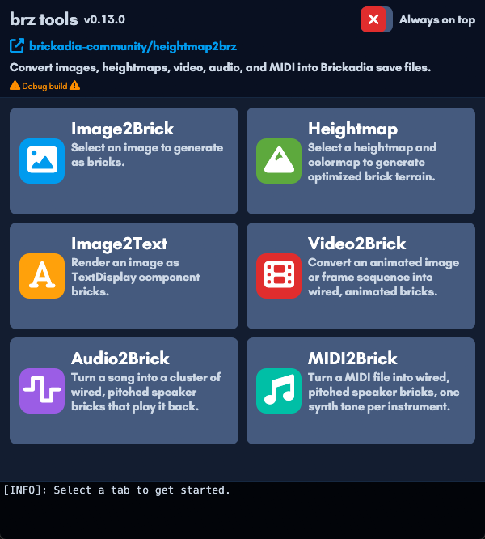
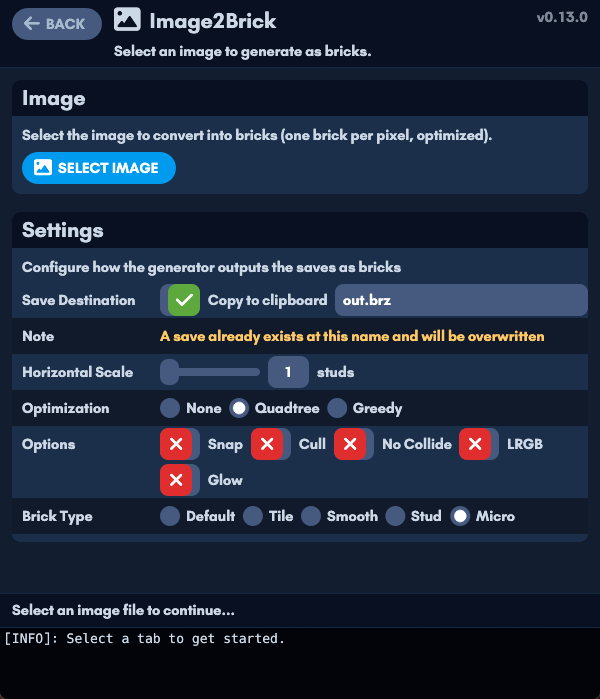

# Heightmap2BRZ

Convert **images, heightmaps, audio, video and MIDI** into Brickadia save files.
One tool that is a heightmap2brz, img2brz, img2text, audio2brick, video2brick and
midi2brick - with a native, Brickadia-themed GUI and a WebAssembly build.

[Download from here](https://github.com/Meshiest/heightmap2brz/releases) or visit [heightmap.brickadia.dev](https://heightmap.brickadia.dev/)





### Modes

The input file plus one mode flag decide what gets built. Everything else tunes
the chosen pipeline.

| Mode | Selected by | Builds |
| --- | --- | --- |
| **Heightmap to bricks** | *(default)* | terrain from one or more heightmap PNG/JPGs plus a colormap |
| **Image to bricks** | `-i` / `--img` | a flat picture, one brick per pixel |
| **Image to text** | `--text` | `Component_TextDisplay` glyph bricks |
| **Audio to speakers** | `--audio-mode bank\|voice` | a cluster of wired, pitched speakers that play a song |
| **Video to display** | `--anim-mode brick\|text` | an animated display screen driven by an in-chip clock |
| **MIDI to speakers** | `--midi` | an event-based speaker world that plays a `.mid` |

### Compiling

You need [rust](https://www.rust-lang.org/). A
[`justfile`](https://just.systems/) wraps the common commands:

| Task | `just` | equivalent `cargo` |
| --- | --- | --- |
| Build the CLI | `just build` | `cargo build` |
| Run the GUI | `just gui` | `cargo run --bin heightmap_gui --features gui` |
| Type-check | `just check` | `cargo check` |
| Run the tests | `just test` | `cargo test` |
| Release build (CLI + GUI) | `just dist` | `cargo build --release --bin heightmap` and `--bin heightmap_gui --features gui` |

To build the GUI binary without running it:
`cargo build --bin heightmap_gui --features gui`. `just sandbox` opens a live
gallery of the Brickadia egui theme.

There is also a WebAssembly build of the GUI (audio, video and MIDI modes run in
the browser); it is served with [trunk](https://trunkrs.dev/) from `index.html`.

### Usage

```
heightmap <input files> [flags] -o out.brz
```

The default mode turns heightmap images into terrain; the **mode** flags below
pick a different pipeline. Run `heightmap --help` for the complete,
self-documenting list - there are many more options than shown here, especially
for audio and video.

```
Common:
  -o, --output <file>     Output save (.brz or .brdb; default ./out.brz)
  -c, --colormap <file>   Colormap image for a heightmap (PNG/JPG)
  -s, --size <n>          Brick stud size per pixel (default 1)
  -v, --vertical <n>      Vertical scale / height multiplier (default 1)
      --cull              Drop bottom-level and fully transparent bricks
      --glow              Emit at 0 glow intensity
      --nocollide         Disable brick collision
      --hdmap             RGB-encoded high-detail heightmap
      --lrgb              Treat input colour as linear rather than sRGB

Heightmap surface:
      --tile/--smooth/--micro/--stud   flat-topped brick style
      --greedy                         greedy meshing
      --terrain                        smooth micro-wedge surface
      --rampify                        Wrapperup ramps over the columns
      --prefab                         write a prefab bundle, not a world

Modes:
  -i, --img                       render a flat image instead of terrain
      --text                      render as TextDisplay glyph bricks
      --audio-mode <bank|voice>   build a speaker cluster that plays audio
      --anim-mode  <brick|text>   build an animated display from a video
      --midi                      build a speaker world that plays a .mid
```

### Heightmaps

```
heightmap heightmap.png -c colormap.png -s 4 -v 20 --tile -o map.brz
```

Provide several input files to stack heightmaps for extra vertical resolution
(see the `stacked_N.png` files in `example_maps`):

```
heightmap example_maps/stacked_1.png example_maps/stacked_2.png example_maps/stacked_3.png --tile
```

To make HD heightmaps for `--hdmap`, use
[Kmschr's GeoTIFF2Heightmap tool](https://github.com/Kmschr/GeoTIFF2Heightmap).

### Smooth surfaces

By default every pixel becomes a flat-topped prism, so a slope renders as a
staircase. Two flags replace that with a sloped surface. They are alternatives
to each other and to `--tile`/`--smooth`/`--micro`/`--stud`, and they choose
their own bricks per cell, so the optimizer flags (`--greedy`, `--snap`) do not
apply to them.

`--terrain` builds the surface out of **micro wedges**. Heights are sampled on a
shared `(w+1) x (h+1)` vertex grid - each vertex is the mean of the pixels
touching it - and every cell picks the assembly from Brickadia's micro wedge
family (ramp, wedge corner, inner corner, or a stacked outer corner plus
triangle) that best matches its four corner heights. Neighbouring cells quote
the same vertices, so their surfaces meet rather than step. Every candidate is
fitted *from below*, so no cell can protrude through its neighbour and a clean
cliff comes out as one exact steep ramp instead of a shelf. Foundations are a
flat-topped field, so they are greedy-merged into boxes rather than left one per
pixel. Costs roughly 0.7 to 2.5 bricks per pixel, depending on how much of the
map is flat and uniformly coloured. Under `--terrain`, `--vertical` is the height
of one shade of grey in units, rounded up to an even number (a wedge's half
height has to be a whole unit).

```
heightmap heightmap.png -c colormap.png --terrain -v 4 -o terrain.brz
```

`--rampify` runs [Wrapperup's rampifier](https://github.com/Wrapperup/rampifier)
over the height columns instead: it fits full-size `PB_DefaultRamp`,
`PB_DefaultWedge` and ramp corner pieces onto the surface and fills the rest
with plain bricks. Coarser than `--terrain` - one plate of vertical resolution,
runs of at most 4 studs - but it builds from ordinary bricks rather than micro
pieces, and flat ground merges into large blocks. Under `--rampify`,
`--vertical` is rounded to a whole number of plates (4 units).

```
heightmap heightmap.png -c colormap.png --rampify -v 8 -o rampified.brz
```

Add `--prefab` to either (or to any heightmap/`--img` render) to write a prefab
bundle instead of a world, so the save can be dropped into Brickadia's `Prefabs`
folder and spawned from the prefab browser.

In the GUI both appear in the **Brick Type** row as *Smooth Terrain* and
*Rampify*.

### Text rendering

`--text` renders an image (or, with `--img`, a flat picture) as
`Component_TextDisplay` glyph bricks. Pick a `--font` preset (`monaspace`,
`iosevka`, `orbitron`), the `--fill-char`/`--empty-char` glyphs, `--char-repeat`,
`--alpha-threshold` and `--material` (`unlit`, `graffiti`, `plastic`,
`metallic`, `glow`, `translucent`, `glass`). `--braille` and `--blocks` pack 8 or
4 pixels per character for dense monochrome output (`--luma-threshold`,
`--invert`).

```
heightmap picture.png -i --text --font orbitron -o picture.brz
```

### Audio to speakers

`--audio-mode` turns an audio file (or the audio track of a video container)
into a cluster of wired, pitched speaker bricks driven by an in-chip clock.

- `bank` (**Pitch-Per-Speaker**): a fixed bank of ~79 speakers, each owning one
  pitch; only their volumes are written each frame. Best for speech and
  broadband material.
- `voice` (**Pitch Switching**): `--max-voices` speakers that track spectral
  peaks and re-pitch every frame - no band grid, so no tuning error. Best for
  tonal material such as piano.

Key knobs: `--synth` (sine/square/triangle/sawtooth), `--bands`/`--subdiv`
(tonal span and resolution - subdiv must be a multiple of 12), `--noise-bands`,
`--gain`, `--peak-gate`, `--attack`/`--release`, and the spatialization flags
`--inner-radius`, `--max-distance` and `--speakers-in-chip`. Some formats need
the ffmpeg backend (see *Video decoding* below).

```
heightmap song.mp3 --audio-mode bank --synth sine -o song.brz
```

### Video & animations

`--anim-mode` turns a video, GIF, WebP, APNG or numbered frame sequence into an
animated display driven by an in-chip clock.

- `brick`: one display brick per pixel.
- `text`: one animated `Component_TextDisplay` per band of image rows - roughly
  two orders of magnitude fewer gates (a 192x108 clip is 113 gates versus 4613),
  at the cost of glyph-grid rendering. Text mode reuses the `--text` glyph flags
  and adds `--colors` (median-cut quantization).

Timing and size: `--fps`, `--start`, `--duration`, `--width`/`--height`,
`--fit` (`exact`/`contain`/`cover`), `--filter` (`lanczos`/`nearest`),
`--max-frames`, `--anim-encoding` (`hex`/`color-array`), `--brick-style` and
`--pixel-extent`. Playback: renders **loop** with pre-wired Pause/Restart/Resume
buttons by default; `--no-loop`, `--no-control-buttons` and `--external-clock`
change that (these apply to audio too).

```
heightmap clip.mp4 --anim-mode brick --fps 15 --width 192 -o clip.brz
```

**Subtitles.** With a video render, `--subtitles <file.srt|.ass>` (or
`--subtitle-track <n>` to pull a text track out of the container) overlays a
single wired `TextDisplay` at the bottom of the screen - two gates for the whole
track. Tune it with `--subtitle-scale` and `--subtitle-lift`.

**Video decoding.** `--backend auto|builtin|ffmpeg` picks the decoder. The
pure-Rust builtin backend handles common formats; others need ffmpeg, which the
tool can download on demand with `--yes` (or refuse with `--no-download`).

### MIDI to speakers

`--midi` reads the input as a Standard MIDI File and builds an **event-based**
speaker world: each track's notes are stored as spans and replayed by a runtime
playhead. `--midi-list` prints the discovered instruments (name, channel, note
count, polyphony) and the file's format/duration/tempo, then exits.

`--polyphony-cap` bounds the speakers per instrument (a busier instrument steals
its oldest sounding note); `--playback-rate` bakes a speed multiplier into the
clock. MIDI reuses the audio spatialization flags (`--inner-radius`,
`--max-distance`, `--speakers-in-chip`), `--gain`, `--no-loop`,
`--no-control-buttons` and one `--synth` tone (per-track tones are a GUI
feature).

```
heightmap song.mid --midi --synth triangle -o song.brz
```

### GUI

`cargo build --bin heightmap_gui --features gui` builds the Brickadia-themed
desktop app, with a pane for each mode (Image/Heightmap, Image2Text,
Video2Brick, Audio2Brick, MIDI2Brick) including a non-blocking, scrubbable
MIDI preview. The same app builds to WebAssembly and runs in the browser.
